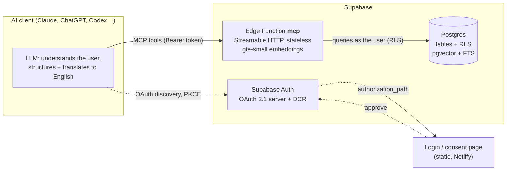
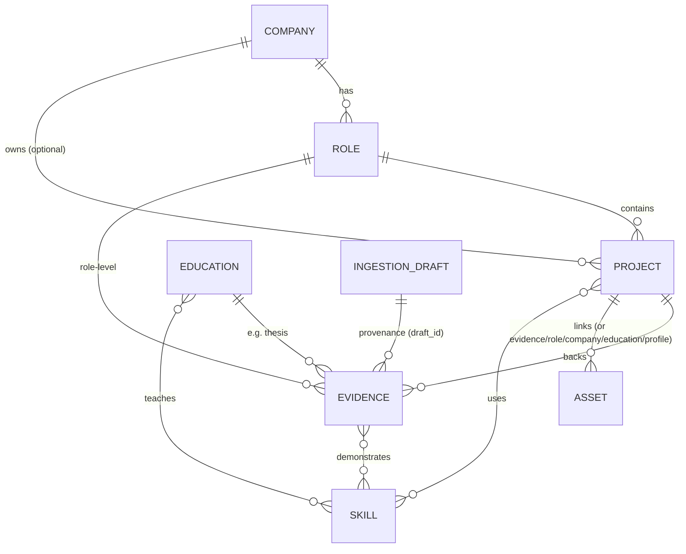

# Career RAG

A private, always-on **professional memory** that any MCP-capable AI client (Claude Code, Claude Desktop / claude.ai,
ChatGPT, Codex…) can query and update. You describe your experience in plain language; the AI structures it into
companies, roles, projects, evidence and skills; this server validates, stores, indexes and retrieves it.

Built entirely on **Supabase** (Postgres + pgvector + full-text search + Edge Functions + Auth OAuth 2.1).
The backend uses **no external AI APIs and no LLM** — embeddings come from Supabase's built-in `gte-small` model.

```
claude mcp add --transport http career-rag https://<project-ref>.supabase.co/functions/v1/mcp
```

---

## Why

CVs and LinkedIn profiles are lossy. Multidisciplinary experience (backend, architecture, leadership, business,
mentoring…) doesn't fit neatly under job titles. Career RAG makes **projects and evidence** — concrete things you
did, achieved, designed, implemented or led — the unit of retrieval, so an assistant can answer:

- *"What experience do I have designing asynchronous backend systems?"*
- *"Where have I used Kafka / Terraform / FastAPI?"*
- *"Here's a job offer — which requirements can I back with evidence, and where are the gaps?"*

…with answers grounded in what you actually told it, with provenance, and without inventing anything.

## Architecture



- **The client's LLM does the thinking**: it understands what you said (in any language), splits it into
  projects/evidence/skills, normalizes the semantic text to English, and calls the tools.
- **The server is deterministic**: validation, storage, hybrid retrieval, heuristic matching. It cannot
  hallucinate experience because it never generates any.

## Data model



| Table | Purpose |
|---|---|
| `companies`, `roles`, `projects`, `education` | Career structure. Personal / open-source projects have no company or role. |
| `evidence` | One concrete thing done/achieved. `statement_en`, `impact_en`, `metrics`, `certainty` (explicit / inferred) + `inference_note`, `source_text`. |
| `skills` | Technologies, practices, capabilities, domains, languages. De-duplicated by normalized name (`Fast API` = `FastAPI`), with aliases. |
| `evidence_skills`, `project_skills`, `education_skills` | Links, each with its own `certainty`. |
| `assets` | Links (repo, demo, talk, article, video, certificate…) with an English `description_en`, attached to at most one company / role / project / evidence / education, or to the profile. |
| `ingestion_drafts` | Pending / committed / discarded change sets with the user's original message. |
| `knowledge_chunks` | **Derived** search index (text, `tsvector`, `vector(384)`, denormalized filters). Rebuildable at any time. |

### Two languages, on purpose

`gte-small` is English-only, so every record keeps two layers:

- `*_en` fields (`statement_en`, `summary_en`, …) — English text optimized for semantic search, written by the client.
- `source_text` — what the user **actually said**, verbatim, in their language. Never translated, never dropped.

Inferences are stored as `certainty: "inferred"` with an explanation; they are never silently turned into facts.

### Links (assets)

URLs are first-class: each link gets its own search chunk built from its title, kind, English description,
source domain and the context of what it's attached to, and parents list their links in their own chunk. Search
"talk about event sourcing" and the YouTube link comes back with its project. Since embeddings are text-only,
the description (written by the client, which can see images / summarize videos) is what makes media findable.

## Retrieval

`hybrid_search` (SQL) fuses three ranked lists with **Reciprocal Rank Fusion**:

1. **Semantic** — cosine similarity on `gte-small` embeddings (HNSW index).
2. **Full-text** — Postgres `tsvector` (English config, OR-query, title and skills weighted higher).
3. **Exact skill match** — query tokens and n-grams are normalized and matched against skill names and aliases
   (`"Apache Kafka"`, `"kafka"`, `"Kafka,"` → `Kafka`), so technology queries hit precisely.

Plus structured filters (entity types, company / role / project, project kind, required skills, date range,
explicit-only) and a small type prior (evidence and projects first). Results that are supported only by weak
semantic similarity are dropped, because `gte-small` gives ~0.8 similarity even to unrelated text.

`match_job_requirements` runs the same search per requirement and returns a heuristic
`coverage_signal` (`strong | partial | weak | none`) plus the supporting evidence. It's a retrieval signal, not a
judgment: the client is told to read the evidence and to report gaps honestly.

## MCP tools

| Tool | Description |
|---|---|
| `get_profile_overview` | Career skeleton with ids: companies → roles → projects, personal projects, education, skills, pending drafts. |
| `search_career` | Hybrid search with filters. Query must be English. |
| `get_entity` | Full context of a project (company, role, every evidence with provenance, skills, links, siblings) or of a role, company, evidence, education, asset or skill. |
| `match_job_requirements` | Evidence per job requirement + coverage signal. |
| `prepare_changes` | **Step 1** of every write: validates a list of `create / update / delete / unlink_skill` operations on companies, roles, projects, evidence, education, skills and assets (links) (with `ref`s linking new items), checks ids exist, flags duplicates, non-English text and missing provenance, and stores a **pending draft** with a human-readable preview. |
| `commit_draft` | **Step 2**: `commit` (atomic, all-or-nothing, then re-index) / `discard` / `show`. Clients are instructed to commit only after explicit user confirmation. |
| `reindex` | Rebuild chunks from the source-of-truth tables and embed pending ones in batches. |

Tool descriptions and server `instructions` teach clients the rules: search before assuming, never invent ids,
English semantic text, keep provenance, mark inferences, confirm writes.

### Agent skill

[`skills/career-rag/SKILL.md`](skills/career-rag/SKILL.md) is a Claude skill with the full playbook (data model,
language rules, ingestion / correction / job-matching workflows, examples).

- Claude Code: `ln -s "$PWD/skills/career-rag" ~/.claude/skills/career-rag`
- claude.ai / Claude Desktop: upload [`skills/career-rag.zip`](skills/career-rag.zip) in Settings → Capabilities → Skills.

## Security model

- **OAuth 2.1** with Supabase Auth as authorization server: dynamic client registration, PKCE, refresh tokens.
  The MCP function is the protected resource and publishes
  [RFC 9728](https://datatracker.ietf.org/doc/html/rfc9728) metadata; unauthenticated requests get
  `401` + `WWW-Authenticate: Bearer resource_metadata=…`, which is how clients discover the login flow.
- Access tokens are verified in the function against the project JWKS (ES256), issuer and audience.
- **Single-owner**: sign-ups are disabled, and the function only accepts user ids listed in the
  `CAREER_RAG_ALLOWED_USER_IDS` secret.
- **Row Level Security** on every table (`user_id = auth.uid()`, forced). The function queries Postgres **as the
  user** with their token — no service-role key is used at runtime, none is stored in code.
- `anon` has no table privileges and no function `EXECUTE`; REST, RPC and GraphQL return permission errors without a user token.
- All SQL functions are `SECURITY INVOKER` with a fixed `search_path`.
- The consent page is static and only contains the project URL and the **publishable** key (public by design).
  It sends strict CSP / no-referrer / frame-deny headers.

Knowing the MCP URL is not enough to read anything: every tool requires a token obtained by logging in as the owner.

## Repository layout

```
supabase/
  config.toml                  auth settings (sign-ups off, OAuth server, consent path) + function config
  migrations/
    …_career_schema.sql        tables, indexes, RLS, grants
    …_career_functions.sql     refresh_chunks, hybrid_search, commit_draft, get_entity_context, …
  functions/mcp/
    index.ts                   routing, OAuth resource metadata, auth, Streamable HTTP transport
    lib.ts                     JWT verification, user-scoped Supabase client, gte-small embeddings
    tools.ts                   MCP tools, validation, draft preparation, matching heuristics
consent-site/                  static OAuth login + consent page (Netlify)
skills/career-rag/             agent skill
```

## Connecting a client

MCP URL: `https://<project-ref>.supabase.co/functions/v1/mcp`

| Client | How |
|---|---|
| Claude Code | `claude mcp add -s user --transport http career-rag <URL>`, then `/mcp` → career-rag → Authenticate |
| Codex CLI | `codex mcp add career-rag --url <URL>` then `codex mcp login career-rag` (syntax may vary by version) |
| Claude Desktop / claude.ai | Settings → Connectors → Add custom connector → URL |
| ChatGPT | Settings → Apps & Connectors → Advanced → Developer mode → Create → URL, OAuth |

The client opens the consent page: sign in with the owner account and click **Approve**.

## Deploy your own

Prerequisites: a Supabase project, Supabase CLI ≥ 2.119 (`npx supabase@latest`), a static host for the consent page
(Netlify used here; Edge Functions cannot serve HTML).

```bash
supabase link --project-ref <ref>
supabase db push                                    # schema + functions (enables pgvector, pg_trgm)

# consent page: set your project URL + publishable key in consent-site/index.html and the CSP in netlify.toml
(cd consent-site && netlify deploy --prod --dir .)

# auth: set site_url to the consent host in supabase/config.toml, then
supabase config push                                # sign-ups off, OAuth 2.1 server + dynamic registration on

# create your user: Dashboard → Authentication → Users → Add user (auto-confirm)
supabase secrets set CAREER_RAG_ALLOWED_USER_IDS=<your auth user id>
supabase functions deploy mcp --use-api
```

Notes:

- `[auth.email] enable_signup = false` would disable the email provider entirely; use the global `[auth] enable_signup = false`.
- The OAuth authorization path must be sent together with `enabled` by the Management API; if `config push` refuses
  to change it, change it in the dashboard (Authentication → OAuth Server).

## Limitations

- **Links only** for media: files (images, PDFs, videos) are not uploaded yet — store them somewhere and link them.
- **English-only embeddings** (`gte-small`): the client must translate semantic text and queries. Original text is kept.
- **Edge worker limits**: ~10 embeddings per request. Commits embed up to 8 chunks; larger imports finish with
  repeated `reindex` calls (clients are told to do so).
- Matching thresholds are heuristics calibrated for `gte-small`; they rank and flag, they don't decide.
- Personal scale: hybrid search scans the owner's chunks with filters before ranking — fine for thousands of items.

## Tests performed on the deployed system

End-to-end with a real OAuth flow (dynamic registration → consent → PKCE token exchange):
fictional experience added through draft → commit; retrieved by semantic query and by exact technology
(Kafka, Terraform, FastAPI); job requirements matched (covered requirements `strong`, unrelated one flagged as a gap);
correction via update draft; invented ids rejected; unauthenticated MCP, REST, RPC and GraphQL access denied;
sign-up blocked; test data deleted and the test client's grant revoked.
